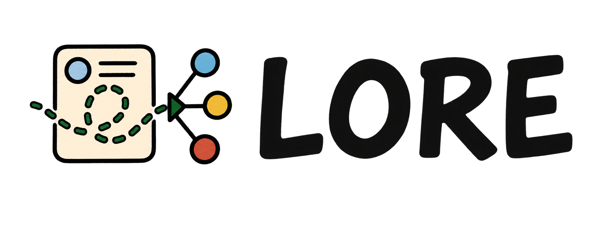
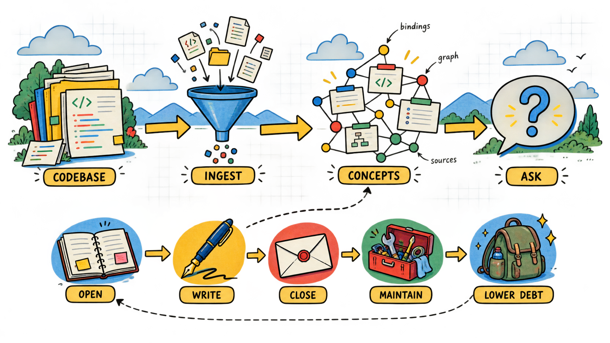

<p align="center">
  <a href="https://github.com/gezibash/lore"></a>
</p>

<p align="center"><strong>Lore</strong> <em>— A local-first codebase knowledge system for AI agents and developers.</em></p>
<p align="center">
  <a href="https://bun.sh/"></a>
  <a href="https://www.typescriptlang.org/"></a>
  <a href="https://github.com/gezibash/lore/stargazers"></a>
  <a href="https://github.com/gezibash/lore/blob/main/package.json"></a>
</p>

Lore turns a codebase into a queryable knowledge graph — named concepts, narrative exploration sessions, symbol-to-file bindings, and a running debt score. It is CLI-first, so agents can ask "how does auth work?" and get a precise, grounded answer with file references instead of grepping blind.



---

## How it works

**Concepts** are named knowledge units (e.g. `auth-model`, `cache-layer`, `query-pipeline`). Each has prose content, embeddings, source symbol bindings, staleness, and a residual score that tracks drift from reality.

**Narratives** are bounded exploration sessions. You open one, write journal entries against explicit concept designations, and close it. On close, Lore groups entries by those designations, synthesizes updated concept state, commits the authoritative merge, and queues residual/binding/graph maintenance behind it. The concept graph grows with every session.

**Debt** is a score that tracks how reliable the knowledge is — how stale, how drifted from source, how clustered. Routine maintenance (heal stale concepts, merge overlaps, refresh bindings) keeps debt low.

---

## Install

Download a release build. The script picks the build for your platform, checks
it against the published checksum, and links it at `~/.local/bin/lore`.

```bash
curl -fsSL https://raw.githubusercontent.com/gezibash/lore/main/install.sh | sh
```

Builds exist for Apple Silicon macOS, and for Linux on x64 and arm64.
Intel macOS has no build, because LanceDB ships no Intel macOS binary.
Pin a version with `LORE_VERSION=v0.1.0`. Remove it with
`install.sh --uninstall`.

### Stay current

```bash
lore upgrade
```

`lore upgrade` reads the latest release, then runs the install script from
that same tag. The binary, its native libraries and the migrations move
together, so the install stays complete.

lore also checks once a day, in the background, and prints one line when a
newer release exists. The check reads a cache file, so it never delays a
command. It stays quiet under `--json`, in a pipe, and on a build machine.

To turn the check off, set `LORE_NO_UPDATE_CHECK=1`.

### Build from source

Requires [Bun](https://bun.sh).

```bash
git clone https://github.com/gezibash/lore
cd lore
bun install
bun run install
```

`bun run install` builds a standalone binary and links it at `~/.local/bin/lore`. The build is copied, not symlinked, so the command keeps working while this repo is mid-edit or mid-rebase. Put `~/.local/bin` on `PATH`. If another `lore` comes earlier on `PATH`, the install says so — remove it, or the new binary never runs.

Install somewhere else with `--prefix <dir>` or `LORE_PREFIX`. Remove it with `bun run install --uninstall`.

To develop lore itself, run `bun run link:global` instead. That points the command at the working tree, so edits apply on the next invocation.

---

## Set up a project

```bash
cd /path/to/your/project

# 1. Exclude what must never enter retrieval
cat > .loreignore <<'IGNORE'
tests/
fixtures/
benchmarks/
dist/
IGNORE

# 2. Register this directory
lore init

# 3. Index it
lore ingest

# 4. Confirm coverage is not zero
lore status
```

### `.loreignore`

Write it before the first ingest. Lore reads `.gitignore` and `.loreignore`, and `.loreignore` has the highest authority. A line that starts with `!` forces a path back in.

Two failures make it necessary. Test files carry ground-truth answers that contaminate retrieval, and an unfiltered workspace indexes gigabytes.

### Choosing the root

`lore init <dir>` registers that exact directory and never returns a parent. Every other command resolves the current directory to its nearest registered ancestor, so subdirectories share the mind at the root.

For a multi-repo workspace, register one mind at the workspace root. Sub-repos then share concepts. If cross-repo answers get worse, near-duplicate code is crowding the retrieved set — split the workspace into separate minds instead.

List every registration with `lore sys ls`. Remove one with `lore sys remove <name>`.

### Keeping the index fresh

Lore answers from the index it built at the last ingest. After an edit that
index is behind, and nothing says so, so `lore ask` answers from the old code.

A git hook closes the gap at the commit, which is the one moment the working
tree is settled and the change is complete.

```bash
lore sys hooks install     # write the post-commit hook
lore sys hooks status      # where it is, and whether it is current
lore sys hooks uninstall   # remove it
```

The hook queues the work and returns, so a commit never waits for a scan. An
ingest reads only the files whose content changed, and the daemon collapses a
second request onto the job already queued, so a run of quick commits leaves
one job.

Queue an ingest by hand with:

```bash
lore ingest --queue
```

Install refuses in two cases, and prints the one line to add by hand instead:

- A `post-commit` hook is already there and lore did not write it. Chaining
  hooks is normal, and that file may be the only thing running git-lfs for the
  repository. Pass `--force` to replace it.
- `core.hooksPath` points outside the repository. git runs that directory for
  every repository that reads the config, so a write there installs the hook in
  all of them.

### Languages

Lore extracts symbols from these languages:

| Language   | Extensions                 | Symbols                                                                       |
| ---------- | -------------------------- | ----------------------------------------------------------------------------- |
| TypeScript | `.ts` `.tsx`               | function, class, method, interface, type, enum, constant                      |
| JavaScript | `.js` `.jsx` `.mjs` `.cjs` | function, class, method, constant                                             |
| Python     | `.py`                      | function, class, constant                                                     |
| Go         | `.go`                      | function, method, struct, interface                                           |
| Rust       | `.rs`                      | function, struct, enum, trait, impl                                           |
| Elixir     | `.ex` `.exs`               | function, module, protocol                                                    |
| Lean 4     | `.lean`                    | theorem, def, abbrev, structure, inductive, instance, axiom, opaque, constant |

A file in another language is still indexed and still answers a `lore ask`.
Lore reads it as text, so it has no symbols. Three features need symbols:
`lore sys concept bind`, `lore ask --mode code`, and `lore sys coverage`.

Lean gets its own symbol kind for a theorem, separate from a function. A
theorem states a fact, and the proof is only the body, so `lore show` marks
which bindings of a concept are claims and which are definitions.

Lore reads a Lean namespace as part of the name, and binds
`Auth.Token.refresh`, not `refresh`. A section bounds variables and not names,
so it changes no name.

No package publishes a Lean grammar, so lore carries the built parser at
`packages/core/grammars/tree-sitter-lean.wasm`. To rebuild it, run
`scripts/build-lean-grammar.sh`. The script pins the grammar commit and needs
Docker or Emscripten.

The Lean grammar is experimental, and it reads mathematics better than it
reads metaprogramming. On the `batteries` library, 258 files, lore finds:

| Content                       | Declarations found |
| ----------------------------- | ------------------ |
| Theorems                      | 98%                |
| All mathematical definitions  | 97%                |
| Tactics, elaborators, linters | 48%                |

A tactic file uses `do` notation and syntax quotations, and the parser stops
early in them. It never fails a file: it returns the declarations it read and
skips the rest. Expect full results for a file of theorems and definitions,
and gaps in a file that extends Lean itself.

---

## Quick start

```bash
# Ask a question
lore ask "how does the auth flow work?" --sources

# Open a narrative, journal findings, close
lore open fix-auth-race "Investigate race condition in token refresh" --target update:auth-model
lore write fix-auth-race "The race is in refreshToken — two concurrent calls both pass the expiry check before either writes the new token" --symbol refreshToken --ref src/auth.ts:44-97
lore close fix-auth-race --wait

# Re-index the touched file and bind the symbol
lore ingest src/auth.ts
lore sys concept bind auth-model refreshToken

# Check status and debt
lore status
lore suggest
```

---

## CLI

### Core workflow

| Command                          | Description                                                |
| -------------------------------- | ---------------------------------------------------------- |
| `lore init [path] [name]`        | Register a codebase                                        |
| `lore ingest [file]`             | Index source code and docs. `--force` re-chunks every file |
| `lore open <narrative> <intent>` | Start an exploration session                               |
| `lore write <narrative> <entry>` | Journal a finding against explicit concept designations    |
| `lore note <entry>`              | Journal a finding. Lore picks the narrative and concept    |
| `lore ask <query>`               | Query the knowledge graph                                  |
| `lore close <narrative>`         | Queue a close job. `--wait` blocks until it finishes       |
| `lore rebuild <concept>`         | Rewrite a concept body from its inputs                     |

### Rebuilding a concept

A concept is a rollup of the journal entries designated to it and the code it is bound to. `lore rebuild <concept>` recomputes the body from those inputs and discards the current prose:

```bash
lore rebuild numscript-movement-posting
```

Use it when a wrong sentence sits in a concept body. A close merges into the body, so the sentence survives. A rebuild does not read the body, so the sentence goes.

The old body stays in the version history — `lore show <concept>@<ref>` still prints it. If the generator returns an empty body, the rebuild stops and the current body stays. A concept with no journal entries cannot be rebuilt.

`lore sys rebuild` is a different command. It rebuilds the database from the files on disk.

### Declaring targets on open

`lore open --target <op>:<concept>` tells the close which concepts the narrative may write. Repeat the flag once per target.

| Target                      | Effect                                  |
| --------------------------- | --------------------------------------- |
| `create:<name>`             | The narrative introduces a new concept  |
| `update:<name>`             | The narrative feeds an existing concept |
| `rename:<old>:<new>`        | Rename on close                         |
| `merge:<src>:<into>`        | Fold one concept into another           |
| `archive:<name>[:<reason>]` | Retire a concept                        |
| `split:<name>[:<parts>]`    | Break a concept apart                   |
| `restore:<name>`            | Bring an archived concept back          |

`create:<name>` against an archived name restores that concept and writes the new body onto it. The close reports the restore. If the name belongs to a concept that was merged into another, the close stops and names that concept.

`lore write` needs `--concept` unless the narrative has exactly one create/update target. Add `--symbol` for touched symbols and `--ref` for file or line references.

### Capturing without the ceremony

`lore write` asks for a narrative and a concept on every entry. That precision
pays at close. It costs at capture, and capture is where an agent gives up: a
finding never written costs more than one filed under the wrong concept,
because a close can move prose and cannot recover what nobody wrote.

`lore note` asks for neither and works both out.

```bash
lore note "Two concurrent refreshes both pass the expiry check" --ref src/auth.ts:44-97
```

Lore picks the narrative: the one open narrative, or a standing `inbox` it
opens when none is open or several are. It picks the concept by searching the
note text with the same retrieval that answers a question, so a note lands
where a reader looking for it would search. It then prints what it chose:

```
Noted in inbox (opened)
  filed under auth-model — pass --concept to override
```

`--concept` skips the search. `--narrative` skips the choice. `--symbol` and
`--ref` work as they do on `lore write`.

Lore refuses rather than guess in two cases: a lore with no concepts yet, and a
note that matches no target the narrative declared. Both name the fix.

### Asking

| Flag          | Effect                                                                   |
| ------------- | ------------------------------------------------------------------------ |
| `--mode arch` | Architectural answer. This is the default                                |
| `--mode code` | Injects the bodies of bound symbols. Use it for implementation questions |
| `--sources`   | Show which chunks produced the answer                                    |
| `--brief`     | Targeted excerpts instead of full dumps                                  |
| `--concise`   | A 1-2 sentence answer                                                    |
| `--search`    | Include external web search results                                      |
| `--debug`     | Trace the retrieval pipeline and explain the selection                   |

Every ask returns a result ID. Chain follow-up work to it:

```bash
lore ask "where does close queue work?" --sources
lore recall <result-id> --section sources
lore open fix-close-latency "Cut close latency" --from-result <result-id>
lore score <result-id> 4
```

`--from-result` also works on `show`, `trail`, and `close`.

### Inspection

| Command                    | Description                                                                              |
| -------------------------- | ---------------------------------------------------------------------------------------- |
| `lore status`              | Health snapshot — debt, priorities, dangling narratives. `--details` for the full report |
| `lore ls`                  | List all concepts with residuals and staleness. `--group cluster` to group them          |
| `lore show <concept>`      | Full concept: content, relations, symbol bindings. Supports `concept@ref`                |
| `lore trail <narrative>`   | Reconstruct the full investigation trail                                                 |
| `lore log [limit] [since]` | Walk commit history. `since` takes `2w`, a ULID, or `main~N`                             |
| `lore diff <target>`       | Preview a close, or compare `ref..ref`                                                   |
| `lore suggest`             | Prioritized maintenance plan. Filter with `--kind`                                       |
| `lore usage`               | What this lore has spent on AI calls. `--all` for every lore                             |

### Spend

Every AI call records its token counts against the lore that made it, so spend is attributable per project.

```bash
lore usage                    # this lore, grouped by model
lore usage --by operation     # where the tokens went: ask, close, ingest
lore usage --all --since 2w   # every lore, last two weeks
```

Money is priced at report time from the provider's live catalog, not stored, because a price belongs to the model today rather than to a call made last month. A model with no published price shows its tokens and no cost, and the total is marked `≥` to say it is a floor.

Recording starts when the table is created. Calls made before that are not backfilled.

### KPIs

Track a metric as a timeseries so each reading carries provenance — narrative, git head, lore commit — instead of living in a scratch CSV.

```bash
lore kpi log recall@10 0.518 --direction up --meta bench=httpx
lore kpi goal recall@10 0.8
lore kpi log recall@10 0.61
lore kpi status recall@10
```

The first `log` for a KPI needs `--direction up|down`. Readings attach to the sole open narrative; pass `--narrative <name>` when several are open.

### System (`lore sys`)

```bash
lore sys ls                                  # every registered lore
lore sys provider models openrouter --search glm   # catalog, with context and price
lore sys config show                         # resolved config, with override annotations
lore sys config set ai.generation.model qwen3:8b
lore sys coverage --uncovered                # exported symbols with no concept
lore sys concept bind auth-model refreshToken
lore sys relations set auth-model session-store depends_on
lore sys health heal                         # refresh high-stale concepts
lore sys embeddings refresh                  # re-embed with the current model
lore sys worker --watch                      # ask the daemon to drain jobs
```

Also available: `narrative designate`, `migrate`, `migrate-status`, `repair`, `audit`, `rebuild`, `reset`, `remove`, and `provider` for shared credentials.

---

## The daemon

A local daemon owns the job queue. Any command starts it on demand, so there is nothing to launch by hand.

```bash
lore daemon status
lore daemon logs
lore daemon stop
```

Merge closes are asynchronous by default:

```bash
lore close fix-auth-race     # returns a job ID
lore jobs                    # queued, leased, done, failed
lore job <id>
lore wait <id>
```

Use `lore close --wait` when the next step depends on the integrated concept state. `--merge-strategy` selects how the entries land:

| Strategy          | What it does to the concept body                                              |
| ----------------- | ----------------------------------------------------------------------------- |
| `patch` (default) | Rewrites only the paragraphs the entries touch. Keeps the rest word for word. |
| `extend`          | Keeps every section. Adds new sections for new topics.                        |
| `correct`         | Treats the entries as the truth. Drops a claim the entries do not support.    |
| `replace`         | Writes a new body from the entries. The old prose is gone.                    |

`patch` and `extend` cannot remove text. `correct` and `replace` can.

The daemon serves the code it was spawned with. It compares its start time against the newest `.ts` file under the workspace root and restarts itself before dispatch. A busy daemon is left alone, because a leased job holds state a restart would strand. The check applies only to a source checkout: a compiled binary carries its code inside itself, so a restart cannot make it newer. Set `LORE_DAEMON_STALE_CHECK=0` to opt out.

---

## Configuration

Lore uses layered config with this precedence (highest wins):

```
hardcoded defaults → ~/.lore/config.json → <project>/.lore/config.json → programmatic
```

On first `lore init`, `~/.lore/config.json` is seeded with readable defaults. Per-project config lives alongside your code and can be version-controlled. Inspect the resolved result with `lore sys config show`.

`ai.search.timeouts.executive_summary_ms` caps the answer step of `lore ask`. It defaults to 300000, because a slow model needs minutes on an architectural question. A cap the model cannot meet no longer costs the answer: `lore ask` reports the failure and prints the retrieved sources.

```bash
lore sys config set ai.search.timeouts.executive_summary_ms 120000
```

### Providers

**Embedding providers:** `ollama` · `openai` · `openai-compatible` · `openrouter` · `voyage` · `gateway`

**Generation providers:** `ollama` · `openai` · `groq` · `openai-compatible` · `openrouter` · `moonshotai` · `alibaba` · `gateway`

`gateway` is **Vercel AI Gateway**, which routes to many model providers on one key. `openai-compatible` reaches anything that speaks the OpenAI API — Cloudflare Workers AI at `https://api.cloudflare.com/client/v4/accounts/{account_id}/ai/v1`, Together, Fireworks, a local vLLM — with no code change. Set `base_url` on the credential first.

### Picking a model

Three commands: see what you have, search what it serves, adopt one.

```bash
# What is configured, what can be listed, what this project uses
lore sys provider list

# Search one provider, or every configured one at once
lore sys provider models openrouter --search glm
lore sys provider models --search glm-5.3 --sort price

# Point this project at a model. The id is checked before it is written.
lore sys provider use openrouter z-ai/glm-5.3-flash
```

`models` sorts by id by default; `--sort price` is cheapest first and `--sort context` is roomiest first. Models with no price sort last either way. It shows only models lore can be configured with — `--type embedding` narrows further, `--all-kinds` includes the video, image, and speech models a provider may also serve.

`openrouter`, `gateway`, `openai`, `groq`, and `ollama` publish a catalog. `openai-compatible` needs a `--base-url` on the credential first. The rest have no catalog endpoint and say so. With no provider named, `models` queries every provider that has a catalog and a key; one unreachable provider is reported in a footer and the rest still list.

Check what a key has left before a long run:

```bash
lore sys provider usage openrouter
```

Only `openrouter` and `gateway` report a balance; the rest publish no such endpoint and say so. OpenRouter also splits spend for this key from the account total, and shows today's and this month's.

`use` writes to the current project by default, so the same key can drive a different model in every repo. `--scope global` writes `~/.lore/config.json` instead, setting the default for every lore; a project setting still wins over it. Either way the write keeps every other key in the file, including your API key.

Add `--embedding --dim <n>` to switch the embedding role, and `--skip-verify` to write an id the catalog does not know yet.

Default (no config needed): local Ollama with `qwen3-embedding:8b` (4096-dim) + `qwen3:8b`.

Example `~/.lore/config.json`:

```json
{
  "ai": {
    "embedding": {
      "provider": "openai",
      "model": "text-embedding-3-small",
      "dim": 1536,
      "api_key": "sk-..."
    },
    "generation": {
      "provider": "openai",
      "model": "gpt-4o-mini",
      "api_key": "sk-..."
    }
  }
}
```

A separate code embedding model can be configured under `ai.embedding.code` for better symbol search (e.g. `voyage-code-3`). It inherits provider, base URL, and key from `ai.embedding` unless you override them.

---

## Agent skill

`skills/lore/` teaches an agent this workflow. Install it two ways: with the
skills CLI, which reaches every agent, or with lore, which carries the skill
inside the release.

```bash
lore skill install                                  # Claude Code, every project
lore skill install --agent codex --agent cursor     # other agents
lore skill install --project                        # this project only
```

`lore skill install` hands the work to the skills CLI, which reaches 70+ agents.
It passes the skill this binary carries, not the repository, so the skill always
matches the lore that installed it.

The skills CLI copies. A copy does not follow `lore upgrade`, so run
`lore skill install` again after one. `lore skill status` reports when the copy
and the binary disagree.

```bash
lore skill install --link    # link instead, and follow every upgrade
```

`--link` needs no network and no npx. The link points inside the install, so the
skill tracks the binary through an upgrade with no second command. It covers
Claude Code at the personal level only. lore falls back to it when npx is
absent.

Install from the repository instead, without lore:

```bash
npx skills add gezibash/lore
```

GitHub is the registry for that CLI, so there is nothing to publish.

```bash
lore skill status      # where it is, and whether it follows this lore
lore skill uninstall   # remove it
```

`--copy` writes a detached copy instead of a link. `lore skill status` then
reports when the copy and the binary disagree, and `lore skill install --copy`
refreshes it. `--dir` installs somewhere else.

Install refuses to overwrite a directory it does not recognise. Pass `--force`
when you mean to replace it.

---

## Architecture

Strict layered monorepo — dependency direction is one-way:

```
@lore/cli  ─┐
            ├─→  @lore/worker  →  @lore/sdk  →  @lore/core
            ↓
       @lore/rendering
```

| Package           | Role                                                     |
| ----------------- | -------------------------------------------------------- |
| `@lore/core`      | Engine, storage, SQLite, embeddings, search, integration |
| `@lore/sdk`       | Canonical API contract over core                         |
| `@lore/worker`    | Single-lore domain client and daemon                     |
| `@lore/rendering` | Shared output formatters (plain, markdown, JSON)         |
| `@lore/cli`       | Terminal adapter                                         |

---

## Development

```bash
bun install          # Install deps
bun run dev          # Run CLI from source
bun run typecheck    # Type-check all packages
bun run test         # Run all tests
bun run lint         # Lint
bun run fmt          # Format
bun run knip         # Find dead exports
bun run build        # Build dist/ without installing it
```

---

## License

MIT
